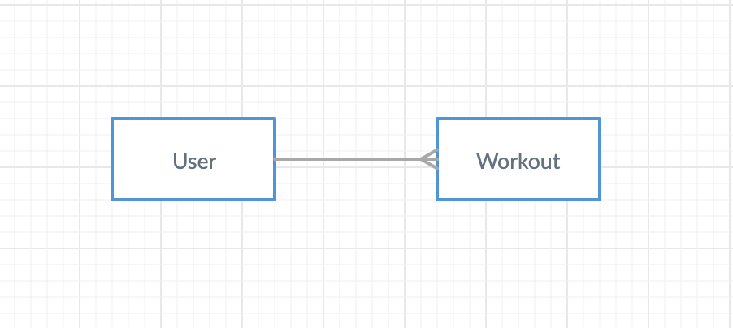

[App name] is an app intended for users to create and manage their workout routines. Users can create, edit, and delete their workouts, view all workouts, and view individual workouts.

[Deployed App](https://mctripp.github.io/workout-tracker-client/#/)
[Deployed Backend](https://workout-tracker-express-api.herokuapp.com/)
[Workout Tracker Client (frontend)](https://github.com/Mctripp/workout-tracker-client)

## Tech Used
- [MongoDB](https://www.mongodb.com/)
- [Mongoose](https://mongoosejs.com/)
- [Heroku](https://www.heroku.com/)

## ERD


## Route Catalog

### Users
| Verb   | URI Pattern            | Controller#Action |
|--------|------------------------|-------------------|
| POST   | `/sign-up`             | `users#signup`    |
| POST   | `/sign-in`             | `users#signin`    |
| PATCH  | `/change-password/` | `users#changepw`  |
| DELETE | `/sign-out/`        | `users#signout`   |

### Workouts
| Verb   | URI Pattern            | Controller#Action |
|--------|------------------------|-------------------|
| POST   | `/workouts`            | `workouts#create`    |
| GET   | `/workouts`             | `workouts#index`    |
| GET   | `/workouts/:id`         | `workouts#show`    |
| PATCH  | `/workouts/:id` | `workouts#update`  |
| DELETE | `/workouts/:id` | `workouts#destroy`   |

## Installation Instructions
You may need to install [Moment.js](https://momentjs.com/) in order for the app to function correctly. This can be done with
```
npm install moment --save
```
from your terminal.

## Planning & Process
I started with the backend on this project, setting up my resources and going over a couple iterations of which properties I thought were necessary. I deployed to heroku and moved to work on my front end. I had not used React much before, so most of the app was a learning process. I tried to keep it simple overall, but ended up going with some Modals and Accordions since they fit the way I wanted to display the app data.

## Unsolved Problems
Unsolved issues are, apart from the stretch user stories, removing a warning related to the entered date's format, figuring out a 3rd party calendar app to use on the site for visual organization, and making the site navigation more fluid (including adding some loading text/pages).
